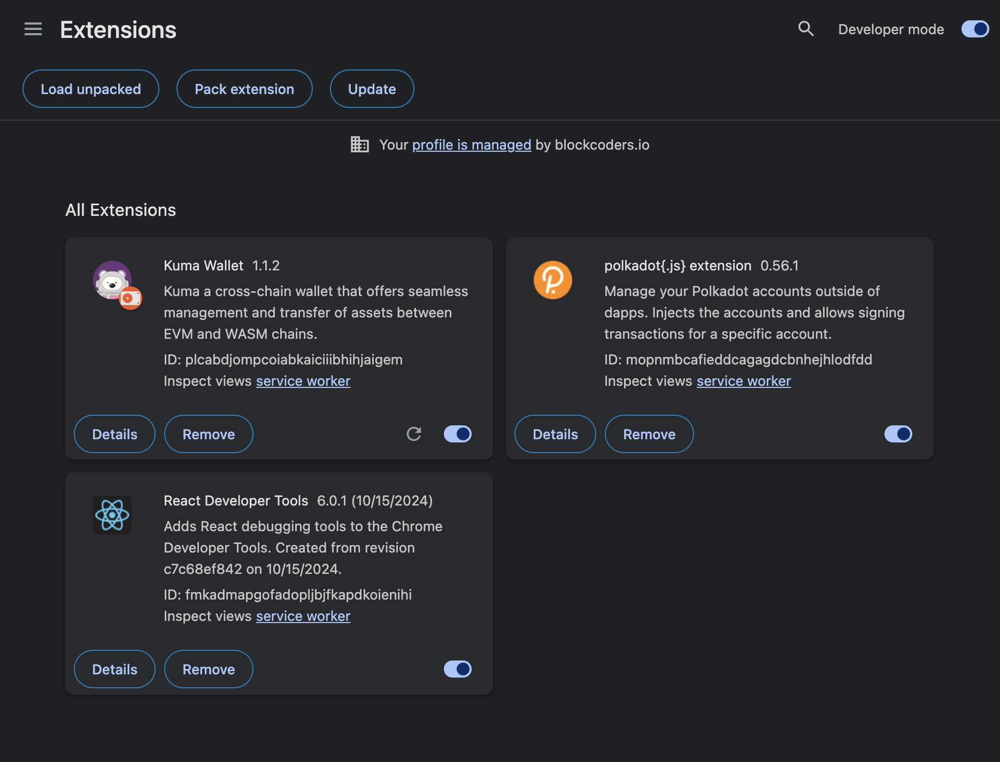
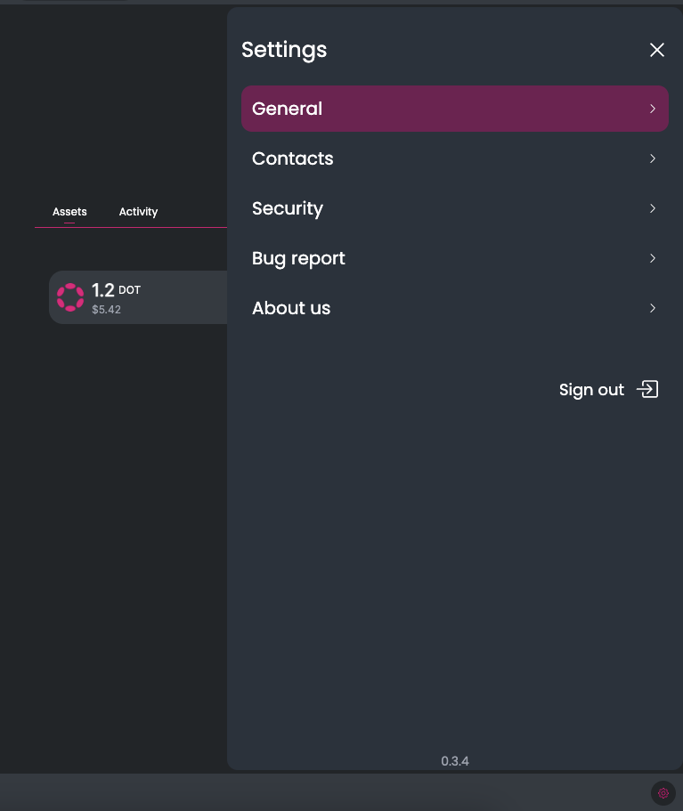
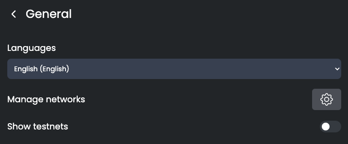
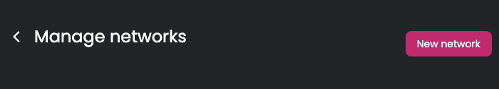
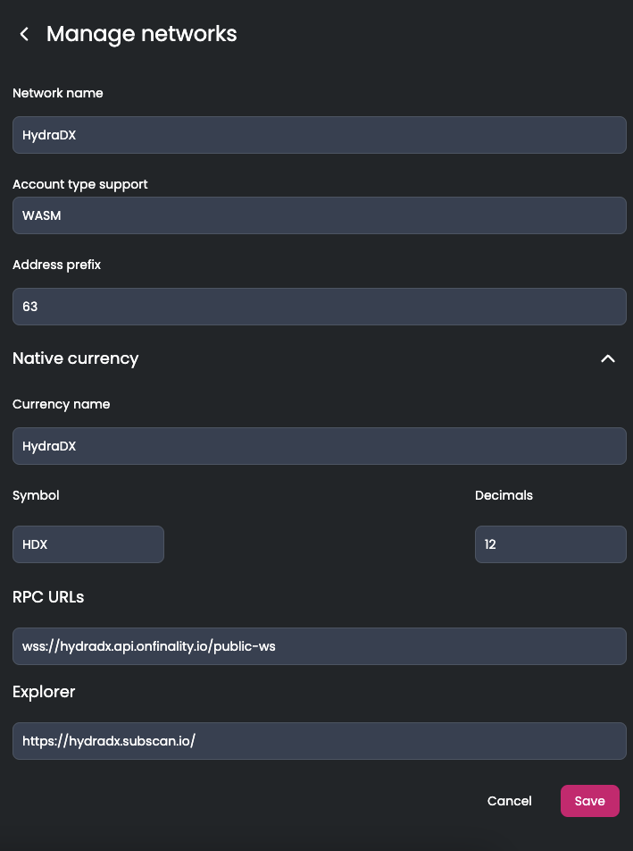
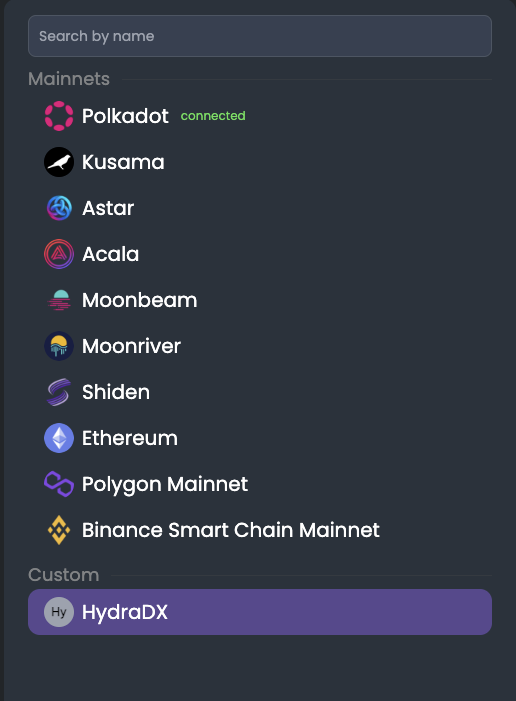
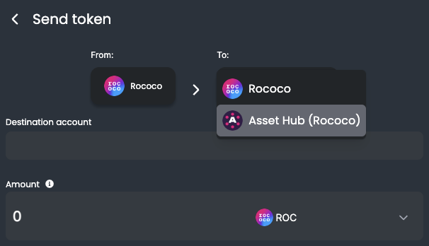

Kuma Wallet
===========

<p align="center">
  
</p>

[](https://dl.circleci.com/status-badge/redirect/gh/kumawallet/extension/tree/main)
[](https://coveralls.io/github/blockcoders/extension?branch=main)
[](https://github.com/kumawallet/extension/actions/workflows/codeql-analysis.yml)
[](https://opensource.org/licenses/MIT)

## Descripción del proyecto

Kuma Wallet es la primera de su tipo, una billetera cross-chain que ofrece una gestión y transferencia de activos sin problemas entre las cadenas EVM y WASM. Esta billetera ha sido diseñada para hacer que la experiencia de manejar activos entre cadenas sea lo más fluida e intuitiva posible. Con Kuma Wallet, los usuarios pueden importar y crear cuentas fácilmente en las cadenas EVM y WASM y transferir sus activos con facilidad, gracias a la integración de XCM. El diseño elegante y fácil de usar de Kuma Wallet se ha inspirado en la exitosa interfaz de usuario de Astar. Estamos comprometidos a brindar soporte continuo a Kuma Wallet, incluido el establecimiento de canales de Telegram y Discord, para garantizar que los usuarios tengan una plataforma para recibir comentarios y abordar cualquier problema que pueda surgir.

### Nuestra visión

- **Fácil de usar**: La billetera se ha desarrollado con énfasis en simplificar la administración de las cuentas EVM y WASM, lo que hace que sea fácil y conveniente para los usuarios manejar sus activos.

- **Transferencia de activos sin problemas**: Kuma Wallet permite a los usuarios transferir sus activos de forma segura entre cuentas en diferentes cadenas, eliminando la necesidad de procesos complejos y lentos.

- **Plataforma segura para la interacción con dApps**: la billetera proporciona una plataforma segura e intuitiva para que los usuarios firmen mensajes e interactúen con dApps, lo que garantiza una experiencia de usuario perfecta.

- **Transparencia y responsabilidad**: Kuma Wallet muestra los detalles de la transacción y los enlaces a las páginas del escáner/explorador, lo que promueve la transparencia y la responsabilidad en todas las transacciones.

- **Naturaleza descentralizada y de código abierto**: la billetera ha sido diseñada con un enfoque en mantener su naturaleza descentralizada y de código abierto, asegurando su confiabilidad y seguridad.

- **Experiencia integral del usuario**: Kuma Wallet tiene como objetivo cubrir más del 90 % de sus funcionalidades principales para brindar una experiencia integral del usuario, lo que la convierte en una solución integral para todas las necesidades de gestión de activos entre cadenas.

### La seguridad es lo primero

Kuma Wallet está diseñado con la seguridad como su máxima prioridad. Para garantizar la seguridad de los activos de los usuarios, hemos implementado el concepto Keyring de MetaMask, que es el núcleo del sistema de administración de cuentas y almacenamiento de secretos en MetaMask. Este enfoque garantiza que las claves privadas se almacenen localmente en los dispositivos de los usuarios, haciéndolas accesibles solo para el usuario.

Además, hemos utilizado técnicas de encriptación, similares a las que usa MetaMask, como la iteración PBKDF2 y el modo AES-GCM, para proporcionar una capa adicional de seguridad para las claves privadas. Estas técnicas de encriptación aseguran que las claves privadas estén protegidas incluso si el dispositivo se pierde o es robado.

Además del cifrado, Kuma Wallet también ofrece una función que permite a los usuarios ver la disponibilidad de diferentes parachains antes de realizar una transferencia. Esta característica, que se implementó a partir de la extensión de Polkadot, brinda a los usuarios una capa adicional de seguridad y tranquilidad, ya que pueden garantizar que su transferencia se realizará sin problemas.

### Especificaciones

**Billetera**

El envío de activos entre cuentas en diferentes cadenas solo será posible si la cuenta del destinatario está en una cadena compatible con la tecnología XCM.
Se agregarán más puentes en el futuro para soportar más cadenas.

**Tecnologías**
- Vite
- React 
- Typescript
- Tailwind
- Polkadot API
- Ethers.js

**Navegadores compatibles**
- Chrome
- Firefox
- Brave

**Redes predeterminadas**
- Astar 
- Acala
- Shiden  
- Moonriver 
- Moonbeam 
- Polkadot 
- Kusama 
- Binance Smart Chain 
- Ethereum
- Polygon

**Tokens Predeteminados**
- ASTR
- SDN
- MOVR
- GLMR
- DOT
- KSM
- BNB
- ETH
- MATIC
- DEV
- GoerliETH
- ACA

**Redes de prueba predeterminadas**

- Shibuya
- Moonbase Alpha
- Goerli
- Binances Smart Chain Testnet
- Polygon Testnet Mumbai
- Sepolia
- Mandala
- Rococo
- Westend
  
## Construcción local

```bash
# Instalar dependencias
npm ci
# Cree la extensión para Chrome (en la carpeta dist/chrome)
npm run build
```
*Nota: como Brave se basa en Chromium, la extensión se puede crear tanto para Chrome como para Brave con el mismo comando.*

## Ejecutando localmente

```bash
# Instalar dependencias
npm ci
# Cree y observe los cambios (Chrome)
npm run dev
```

*Nota: como Brave se basa en Chromium, la extensión se puede crear tanto para Chrome como para Brave con el mismo comando.*

## Cargando la extensión

### Chrome y Brave
Para cargar la extensión en su navegador, debe habilitar el modo desarrollador y cargar la extensión desde la carpeta `dist/chrome`.

Vaya a `chrome://extensions` y habilite el modo desarrollador.

Luego haga clic en `Cargar descomprimida` y seleccione la carpeta `dist/chrome`.



Ahora debería ver la extensión en su navegador.

## Ejecutando pruebas

```bash
# Run tests
npm test
```

## Usando la extensión

Esperamos brindar una experiencia de usuario integral con Kuma Wallet, convirtiéndola en una solución integral para todas las necesidades de gestión de activos entre cadenas. Para lograr este objetivo, hemos implementado una variedad de funciones que harán que la experiencia del usuario sea lo más fluida e intuitiva posible.
Pero en caso de que necesite ayuda, hemos creado una [guía del usuario] (https://docs.kumawallet.io/) para ayudarlo a comenzar.

## Integrar Kuma Wallet a su aplicación

Para integrar Kuma Wallet a su aplicación, siga el ejemplo a continuación.

### Ejemplo

```javascript
// En un contexto donde 'window' esté disponible (por ejemplo, la aplicación que desea integrar Kuma Wallet)
// Verifique si Kuma Wallet está instalado
const isKumaWalletInstalled = !!window.kuma;

// Firmar un mensaje
const signMessage = async (message: string) => {
  if (isKumaWalletInstalled) {
    const response = await window.kuma.call({
      method: "sign_message",
      params: {
        message,
      }
    })
    console.log(response?.message);
  }
}
```

Al intentar firmar un mensaje en Kuma Wallet, aparecerá una ventana emergente que solicitará la confirmación del usuario. El primer paso en el proceso de confirmación consiste en verificar que el sitio sea seguro.

```javascript
// Llamar a un metodo de un contrato
const res = await window.kuma.call({
  method: "call_contract",
  params: {
    address: "0xe14863f40D42386B4eA97a55506926db0CE97403", // Direccion del contrato
    abi, // ABI del contrato (json o string)
    method: "payMeMoney", // Metodo del contrato
    params: {}, // (Opcional) Parametros del metodo del contrato
    value: ethers.utils.parseEther("0.1"), // (Opcional) Cantidad de Tokens a enviar (si el metodo es pagable)
  },
});
```

Al intentar llamar a un metodo de un contrato en Kuma Wallet, aparecerá una ventana emergente que solicitará la confirmación del usuario.

**Nota**: Si el método del contrato es pagable, se le pedirá al usuario que confirme la cantidad a enviar.

"value" puede ser:

* **string** (ej. "0.1" Token Nativo)
* **ethers.utils.parseEther("0.1")** (donde "0.1" es la cantidad de Tokens Nativos a enviar en blockchains EVM)
* **new BN("100000000000000000")** (donde "100000000000000000" es la cantidad de Tokens Nativos a enviar en blockchains Wasm)

## XCM - Transacciones Soportadas

| Transacciones | Astar     | Moonbeam | Polkadot | Acala   | Shiden  | Moonriver | Kusama  |
|---------------|-----------|----------|----------|---------|---------|-----------|---------|
| Astar         | Nativa    | XCM (E)  | XCM (W)  | XCM (W) |---------|-----------|---------|
| Moonbeam      | XCM (W)   | Nativa   | XCM (W)  | XCM (W) |---------|-----------|---------|
| Polkadot      | XCM (W)   | XCM (E)  | Nativa   | XCM (W) |---------|-----------|---------|
| Acala         | XCM (W)   | XCM (E)  | XCM (W)  | Nativa  |---------|-----------|---------|
| Shiden        |-----------|----------|----------|---------| Nativa  | XCM (E)   | XCM (W) |
| Moonriver     |-----------|----------|----------|---------| XCM (W) | Nativa    | XCM (W) |
| Kusama        |-----------|----------|----------|---------| XCM (W) | XCM (E)   | Nativa  |

**Nativa**: En este caso, se admite el movimiento de activos entre la misma cadena, pero no requiere ningún mensaje XCM.

**XCM (W)**: Las transacciones XCM se admiten mediante una cuenta WASM.

**XCM (E)**: Las transacciones XCM se admiten mediante una cuenta EVM.

**Nota**: XCM permite que los activos se transfieran entre cadenas, lo que significa, por ejemplo, que algunos DOT se pueden mover de la cadena 'relay' a alguna parachain o incluso entre parachains. Pero NO admite mover tokens a un ecosistema diferente (otro conjunto de cadena 'relay' / parachains). En otras palabras, no se puede enviar DOT a Kusama usando XCM.

## Agregar nueva cadena
Para agregar una nueva cadena, go to **Configuracion > General > Adminsitrar redes > Nueva Red**, rellena los datos de la cadena, pulsa el botón de guardar y deberías ver la nueva red en la lista de cadenas.











## Probar Transferencias XCM
Puedes transferir ROC de Rococo a AssetHub. Ve a Ajustes > General y activa la opción "Mostrar redes de prueba", luego cambia a Rococo y ya podrás transferir a AssetHub:



## Registro de cambios

Consulte [Changelog](CHANGELOG.md) para más información.

## Contribuyendo

Damos la bienvenida a las contribuciones de la comunidad. Si desea contribuir, lea nuestras [directrices de contribución] (./CONTRIBUTING.md).

## Colaboradores

- [**Jose Ramirez**](https://github.com/0xslipk)
- [**Fernando Sirni**](https://github.com/fersirni)
- [**Ruben Gutierrez**](https://github.com/RubenGutierrezC)

## Créditos

Queremos agradecer a la Fundación Web3 por su apoyo y al equipo de Polkadot por su ayuda y orientación. También queremos agradecer al equipo de Astar por su apoyo en las pruebas Beta y a la comunidad de Polkadot por sus comentarios y apoyo.
Este proyecto fue una gran experiencia de aprendizaje para nosotros y esperamos seguir contribuyendo al ecosistema de Polkadot.
Nuestro equipo principal de desarrolladores ha estado trabajando en este proyecto durante más de 6 meses y estamos muy orgullosos del resultado. Esperamos que disfrute usando Kuma Wallet tanto como nosotros disfrutamos construyéndolo.

## Licencia

Con licencia de MIT - consulte el archivo [LICENSE](LICENSE) para obtener más información.