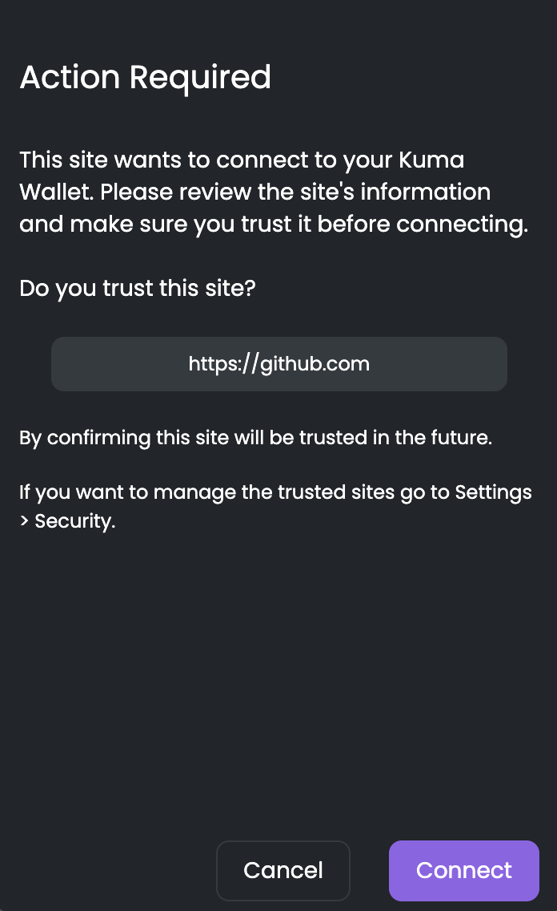
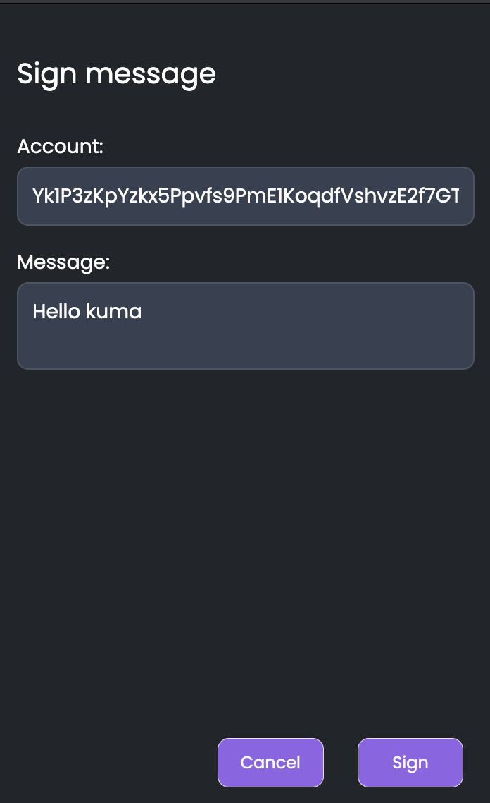

Kuma Wallet
===========

> Kuma is a work in progress. The documentation may not reflect the current implementation. **Expect a stable release and proper documentation for Q3 2023**.

<p align="center">
  
</p>

[](https://circleci.com/gh/blockcoders/kuma-wallet/tree/main)
[](https://coveralls.io/github/blockcoders/kuma-wallet?branch=main)
[](https://github.com/blockcoders/kuma-wallet/actions/workflows/codeql-analysis.yml)
[](https://snyk.io/test/github/blockcoders/kuma-wallet)
[](https://opensource.org/licenses/MIT)


## Project Overview

Kuma Wallet is the first of its kind, a cross-chain wallet that offers seamless management and transfer of assets between EVM and WASM chains. This wallet has been designed to make the experience of handling cross-chain assets as smooth and intuitive as possible. With Kuma Wallet, users can easily import and create accounts on both EVM and WASM chains and transfer their assets with ease, thanks to the integration of XCM. The sleek and user-friendly design of Kuma Wallet has been inspired by the highly successful Astar UI. We are committed to providing ongoing support to Kuma Wallet, including the establishment of Telegram and Discord channels, to ensure that users have a platform for feedback and to address any issues that may arise.

### Our vision

- **User-friendly wallet**: The wallet has been developed with an emphasis on simplifying the management of EVM and WASM accounts, making it easy and convenient for users to handle their assets.

- **Seamless asset transfer**: Kuma Wallet enables users to securely transfer their assets between accounts on different chains, eliminating the need for complex and time-consuming processes.

- **Safe platform for interaction with dApps**: The wallet provides a safe and intuitive platform for users to sign messages and interact with dApps, ensuring a seamless user experience.

- **Transparency and accountability**: Kuma Wallet displays transaction details and links to scanner/explorer pages, promoting transparency and accountability in all transactions.

- **Decentralized and open-source nature**: The wallet has been designed with a focus on maintaining its decentralization and open-source nature, ensuring its trustworthiness and security.

- **Comprehensive user experience**: Kuma Wallet aims to cover more than 90% of its main functionalities to provide a comprehensive user experience, making it a one-stop solution for all cross-chain asset management needs.

### Safesty comes first

Kuma Wallet is designed with security as its top priority. To ensure the safety of users' assets, we have implemented the Keyring concept from MetaMask, which is the core of the secret storing and account management system in MetaMask. This approach ensures that private keys are stored locally on users' devices, making them accessible only to the user.

Moreover, we have utilized encryption techniques, similar to those used by MetaMask, such as PBKDF2 iteration and AES-GCM mode, to provide an extra layer of security for private keys. These encryption techniques ensure that private keys are protected even if the device is lost or stolen.

In addition to encryption, Kuma Wallet also provides a feature that allows users to see the availability of different parachains before they make a transfer. This feature, which was implemented from Polkadot's extension, provides users with an added layer of security and peace of mind, as they can ensure that their transfer will go through smoothly.

### Specifications

**Wallet**

Sending assets between accounts on different chains will be only possible if the recipient's account is on a chain that supports XCM technology.
More bridges will be added in the future to support more chains.

**Technologies**
- Vite
- React 
- Typescript
- Tailwind
- Polkadot API
- Ethers.js

**Supported Browsers**
- Chrome
- Firefox
- Brave

**Default Networks**
- Astar 
- Shiden  
- Moonriver 
- Moonbeam 
- Polkadot 
- Kusama 
- Binance Smart Chain 
- Ethereum
- Polygon

**Default Tokens**
- ASTR
- SDN
- MOVR
- GLMR
- DOT
- KSM
- BNB
- ETH
- MATIC
- DEV
- GoerliETH

**Default Testnets**

- Shibuya
- Moonbase Alpha
- Goerli

## Building locally

```bash
# Install dependencies
npm ci
# Build the extension for both Chrome and Firefox (in the dist/ folder)
npm run build

# Build the extension for Chrome (in the dist/chrome folder)
npm run build:chrome

# Build the extension for Firefox (in the dist/firefox folder)
npm run build:firefox
```
*Note: As Brave is based on Chromium, the extension can be built for both Chrome and Brave with the same command.*


## Running locally

```bash
# Install dependencies
npm ci
# Build and watch for changes (Chrome)
npm run dev
# Build and watch for changes (Firefox)
npm run dev:firefox
```

*Note: As Brave is based on Chromium, the extension can be built for both Chrome and Brave with the same command.*

## Loading the extension

### Chrome and Brave
To load the extension in your browser, you need to enable developer mode and load the extension from the `dist/chrome` folder.

Go to `chrome://extensions` and enable developer mode.


Then click on `Load unpacked` and select the `dist/chrome` folder.


You should now see the extension in your browser.

### Firefox
To load the extension in your browser, load the extension from the `dist/firefox` folder.

Go to `about:debugging#/runtime/this-firefox` and click on `Load Temporary Add-on`.


Then select the `manifest.json` file from the `dist/firefox` folder.


You should now see the extension in your browser.

## Running tests

```bash
# Run tests
npm test
```

## Using the extension

We hope to provide a comprehensive user experience with Kuma Wallet, making it a one-stop solution for all cross-chain asset management needs. To achieve this goal, we have implemented a variety of features that will make the user experience as smooth and intuitive as possible.
But just in case you need help, we have created a [user guide](https://docs.kumawallet.io/) to help you get started.

## Integrate Kuma Wallet to your application

To integrate Kuma Wallet to your application, follow the example below.

### Example

```javascript
// In a context where 'window' is available (e.g. the application that wants to integrate Kuma Wallet)

// Check if Kuma Wallet is installed
const isKumaWalletInstalled = !!window.kuma;

// Sign a message
const signMessage = async (message: string) => {
  if (isKumaWalletInstalled) {
    const response = await window.kuma.call({
      method: "sign_message",
      params: {
        message,
      }
    })
    console.log(response?.message);
  }
}
```

When attempting to sign a message in Kuma Wallet, a pop-up will appear requesting the user's confirmation. The first step in the confirmation process involves verifying that the site is secure.





## Contributing

We welcome contributions from the community. If you would like to contribute, please read our [contributing guidelines](./CONTRIBUTING.md).

## Credits

We want to thanks the Web3 Foundation for their support and the Polkadot team for their help and guidance. We also want to thank the Astar team for their support on Beta testing and the Polkadot community for their feedback and support.
This project was a really great learning experience for us and we hope to continue to contribute to the Polkadot ecosystem.
Our core developers team has been working on this project for more than 6 months and we are really proud of the result. We hope you will enjoy using Kuma Wallet as much as we enjoyed building it. 
